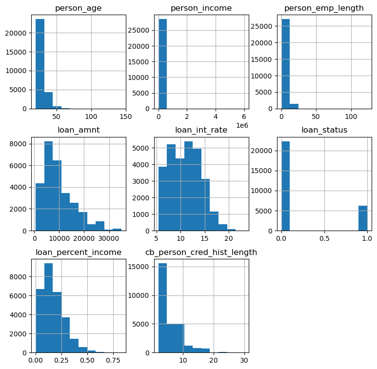
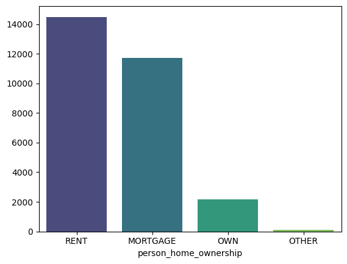
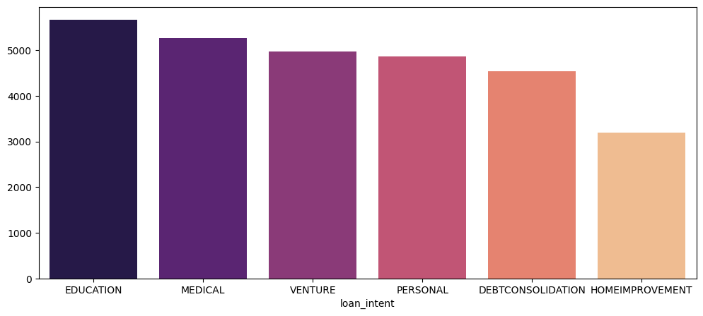
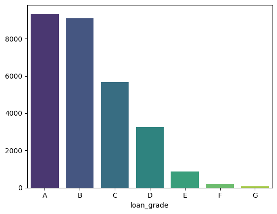
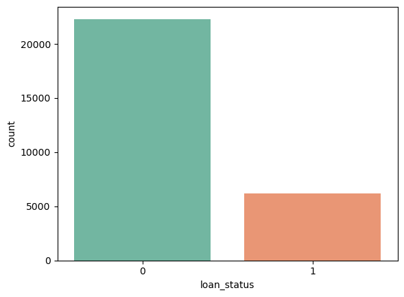
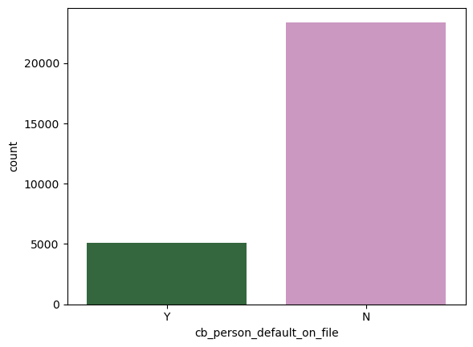
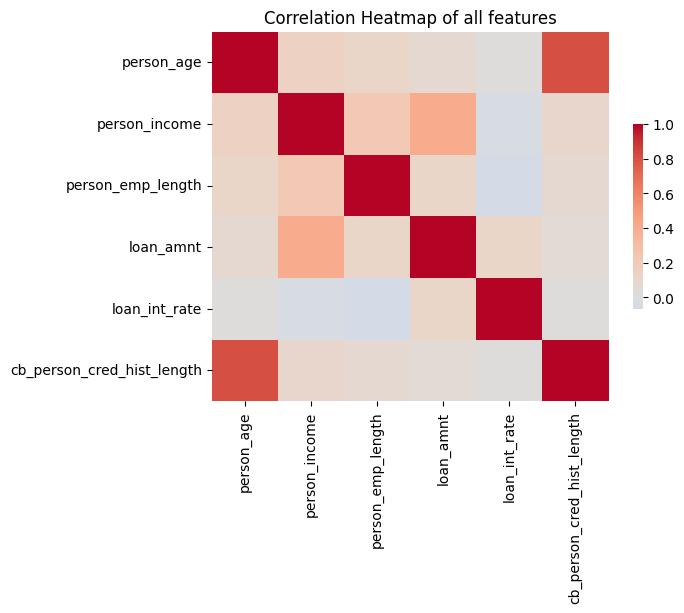
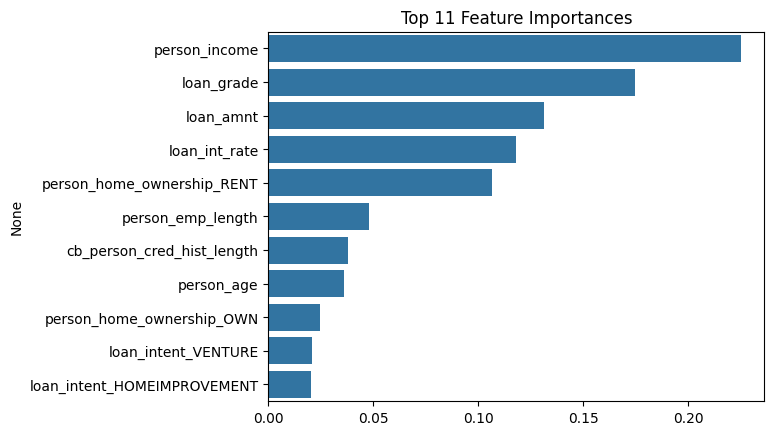

# Data Loading and Cleaning
first i set option to display all columns
dropping duplicated rows  
replacing empty value with numpy nan    
checking for null ways in any column  
dropping rows which contain null values    
deleting one column which is unnecessary   loan_percent_income=(loan_amnt/person_income)*100

## Outliers
beyond age=84 there are ages like 144 and 123 which are clearly outliers  
there are some cases which have retirement time greater than 100  

for less memory usage and faster training i converted dtype from float64 to float32 and int64 to int32  
separating output labels from features  
# Encoding by Pipeline
Using pipeline  
If you run the pipeline on the full dataset before splitting, steps like scaling or encoding will see the test data.  
This causes data leakage, leading to unrealistic, overly optimistic model performance.  
Saving preprocessed dataset
# Visualizations
`Hist plot`
  

`person_home_ownership`  


`loan_intent`  


`loan_grade`  
 

`loan_status`  
  

`cb_person_default_on_file`  
 



# Logistic Regression
`Here, mostly all are having best_f1=0.61 so default is good`
```
solver=lbfgs, penalty=l2 and C=0.01
              precision    recall  f1-score   support
           0       0.92      0.76      0.84      4462
           1       0.48      0.77      0.59      1237
best_f1: 0.60
best_thresh: 0.68


solver=liblinear, penalty=l2 and C=0.01
              precision    recall  f1-score   support
           0       0.92      0.76      0.83      4462
           1       0.47      0.78      0.59      1237
best_f1: 0.60
best_thresh: 0.64


solver=liblinear, penalty=l1 and C=0.01
              precision    recall  f1-score   support
           0       0.92      0.76      0.83      4462
           1       0.47      0.78      0.59      1237
best_f1: 0.61
best_thresh: 0.65


solver=saga, penalty=l2 and C=0.01
              precision    recall  f1-score   support
           0       0.92      0.76      0.84      4462
           1       0.48      0.77      0.59      1237
best_f1: 0.60
best_thresh: 0.68


solver=saga, penalty=l1 and C=0.01
              precision    recall  f1-score   support
           0       0.92      0.76      0.84      4462
           1       0.48      0.77      0.59      1237
best_f1: 0.61
best_thresh: 0.65


solver=lbfgs, penalty=l2 and C=0.1
              precision    recall  f1-score   support
           0       0.92      0.77      0.84      4462
           1       0.48      0.77      0.59      1237
best_f1: 0.61
best_thresh: 0.63


solver=liblinear, penalty=l2 and C=0.1
              precision    recall  f1-score   support
           0       0.92      0.76      0.84      4462
           1       0.47      0.77      0.59      1237
best_f1: 0.61
best_thresh: 0.63


solver=liblinear, penalty=l1 and C=0.1
              precision    recall  f1-score   support
           0       0.92      0.76      0.84      4462
           1       0.47      0.77      0.59      1237
best_f1: 0.61
best_thresh: 0.63


solver=saga, penalty=l2 and C=0.1
              precision    recall  f1-score   support
           0       0.92      0.76      0.84      4462
           1       0.47      0.77      0.59      1237
best_f1: 0.61
best_thresh: 0.67


solver=saga, penalty=l1 and C=0.1
              precision    recall  f1-score   support
           0       0.92      0.77      0.84      4462
           1       0.48      0.77      0.59      1237
best_f1: 0.61
best_thresh: 0.67


solver=lbfgs, penalty=l2 and C=1
              precision    recall  f1-score   support
           0       0.92      0.76      0.84      4462
           1       0.48      0.77      0.59      1237
best_f1: 0.61
best_thresh: 0.63


solver=liblinear, penalty=l2 and C=1
              precision    recall  f1-score   support
           0       0.92      0.76      0.84      4462
           1       0.47      0.77      0.59      1237
best_f1: 0.61
best_thresh: 0.63


solver=liblinear, penalty=l1 and C=1
              precision    recall  f1-score   support
           0       0.92      0.76      0.84      4462
           1       0.48      0.77      0.59      1237
best_f1: 0.61
best_thresh: 0.63


solver=saga, penalty=l2 and C=1
              precision    recall  f1-score   support
           0       0.92      0.76      0.84      4462
           1       0.47      0.77      0.59      1237
best_f1: 0.61
best_thresh: 0.63

solver=saga, penalty=l1 and C=1
              precision    recall  f1-score   support
           0       0.92      0.76      0.84      4462
           1       0.47      0.77      0.59      1237
best_f1: 0.61
best_thresh: 0.63

```

# Decision Tree
`max_depth=10 seems to be optimal for decision tree`
```
max_depth= None, best_f1: 0.73, best_thresh: 0.01
max_depth= 3, best_f1: 0.58, best_thresh: 0.48
max_depth= 5, best_f1: 0.72, best_thresh: 0.58
max_depth= 7, best_f1: 0.79, best_thresh: 0.81
max_depth= 10, best_f1: 0.80, best_thresh: 0.81
```
```
max_depth= 10, best_f1: 0.80, best_thresh: 0.81
max_depth= 15, best_f1: 0.78, best_thresh: 0.96
max_depth= 20, best_f1: 0.75, best_thresh: 0.92
max_depth= 40, best_f1: 0.73, best_thresh: 0.01
```
# RandomForestClassifier
```
for estimators in [100,200]:
  for max_depth in [7,10,15,20]:
    for max_features in ["sqrt","log2"]:
```
```
max_depth=7, estimators=100 and max_features=sqrt
best_f1: 0.74, best_thresh: 0.60

max_depth=7, estimators=100 and max_features=log2
best_f1: 0.74, best_thresh: 0.60

max_depth=10, estimators=100 and max_features=sqrt
best_f1: 0.79, best_thresh: 0.62

max_depth=10, estimators=100 and max_features=log2
best_f1: 0.79, best_thresh: 0.62

max_depth=15, estimators=100 and max_features=sqrt
best_f1: 0.81, best_thresh: 0.55

max_depth=15, estimators=100 and max_features=log2
best_f1: 0.81, best_thresh: 0.55

max_depth=20, estimators=100 and max_features=sqrt
best_f1: 0.81, best_thresh: 0.50

max_depth=20, estimators=100 and max_features=log2
best_f1: 0.81, best_thresh: 0.50

max_depth=7, estimators=200 and max_features=sqrt
best_f1: 0.74, best_thresh: 0.59

max_depth=7, estimators=200 and max_features=log2
best_f1: 0.74, best_thresh: 0.59

max_depth=10, estimators=200 and max_features=sqrt
best_f1: 0.79, best_thresh: 0.62

max_depth=10, estimators=200 and max_features=log2
best_f1: 0.79, best_thresh: 0.62

max_depth=15, estimators=200 and max_features=sqrt
best_f1: 0.81, best_thresh: 0.53

max_depth=15, estimators=200 and max_features=log2
best_f1: 0.81, best_thresh: 0.53

max_depth=20, estimators=200 and max_features=sqrt
best_f1: 0.81, best_thresh: 0.48

max_depth=20, estimators=200 and max_features=log2
best_f1: 0.81, best_thresh: 0.48
```
`Here n_estimators=100/200 and max_features=sqrt/log2 have same performance thus we will fix these now`    

`performance increases as 0.74-0.79-0.81-0.81 for max_depth= [7,10,15,20] thus we will search now in range (10-15)`   

*(keeping fix n_estimators=100, max_features=sqrt)*
```
for max_depth in [12,13,14,15]:
  for min_samples_split in [10,20,40]:
    for min_samples_leaf in [3,5,10]:
```
```
after training on this range best_f1 after threshold optimization was 0.80 for most of them

For these combinations although best_f1 was 0.81
max_depth=13, min_samples_split=10 and min_samples_leaf=5
max_depth=14, min_samples_split=10 and min_samples_leaf=5
max_depth=14, min_samples_split=10 and min_samples_leaf=3
max_depth=14, min_samples_split=20 and min_samples_leaf=3
max_depth=15, min_samples_split=10 and min_samples_leaf=3
max_depth=15, min_samples_split=10 and min_samples_leaf=5
max_depth=15, min_samples_split=20 and min_samples_leaf=3
max_depth=15, min_samples_split=20 and min_samples_leaf=5
```
```
Choosing this as our best model

RandomForestClassifier(max_depth=15,min_samples_leaf=5,min_samples_split=20,n_estimators=100,max_features="sqrt",random_state=42)

               precision    recall  f1-score   support
           0       0.93      0.96      0.95      4462
           1       0.83      0.75      0.79      1237

Confusion Matrix:  [[4277  185]
                   [ 307  930]]
ROC AUC Score: 0.93
best_f1: 0.81
best_thresh: 0.57
```
## Feature Selection
`Now extracting feature importances from our best RandomForest model`
```
Here, 14 features conserve 99% of feature importances  
while 11 features out of 16 conserve 95% of feature importances
```
creating new training and test set based on top 14 and 11 features  
Now training on both 11 and 14 features 
```
With top 14 features
              precision    recall  f1-score   support
           0       0.94      0.95      0.94      4462
           1       0.82      0.76      0.79      1237

Confusion Matrix:  [[4254  208]
                   [ 295  942]]
ROC AUC Score: 0.93
best_f1: 0.80
best_thresh: 0.57


With top 11 features
              precision    recall  f1-score   support
           0       0.94      0.94      0.94      4462
           1       0.78      0.77      0.78      1237

Confusion Matrix:  [[4194  268]
                   [ 281  956]]
ROC AUC Score: 0.92
best_f1: 0.78
best_thresh: 0.50
```
`Based on this results we can choose to pick 14 features rather than 11 features although, all 16 features had greater performance`


# XGBoostClassifier
```
n_estimators=500,
learning_rate=0.05,
max_depth=15,
eval_metric="aucpr"

              precision    recall  f1-score   support
           0       0.94      0.98      0.96      4462
           1       0.92      0.76      0.83      1237

Confusion Matrix:  [[4377   85]
                   [ 302  935]]
ROC AUC Score: 0.94
best_f1: 0.83
best_thresh: 0.51
```
## Using Early Stopping
`Creating validation set from training set with ratio 0.2`
```
Using same parameters with early_stopping_rounds=30

best_iteration= 329, best_score= 0.9889183509672792
              precision    recall  f1-score   support
           0       0.93      0.98      0.96      4462
           1       0.90      0.75      0.82      1237

Confusion Matrix:  [[4363   99]
                   [ 305  932]]
ROC AUC Score: 0.94
best_f1: 0.83
best_thresh: 0.58
```
## GridSearchCV
`We can not use Early Stopping with GridSearchCV`
```
"n_estimators":[500],
"max_depth":[15,20],
"gamma":[0,0.1,0.3],
"learning_rate":[0.01,0.05,0.1],
eval_metric="aucpr"

{'gamma': 0, 'learning_rate': 0.05, 'max_depth': 15, 'n_estimators': 500} 
grid.best_score_= 0.94

              precision    recall  f1-score   support
           0       0.94      0.98      0.96      4462
           1       0.92      0.76      0.83      1237

Confusion Matrix:  [[4377   85]
                   [ 302  935]]
ROC AUC Score: 0.94
best_f1: 0.83
best_thresh: 0.51
```
# Stacking Classifier
```
("log",LogisticRegression(max_iter=6000,random_state=42)),
("rnd",RandomForestClassifier(max_depth=15,n_estimators=100,min_samples_split=20,min_samples_leaf=5,random_state=42)),
("xgb",XGBClassifier(n_estimators=329,learning_rate=0.05,eval_metric="aucpr",max_depth=15,random_state=42))

meta_model1=LogisticRegression(random_state=42)
              precision    recall  f1-score   support
           0       0.94      0.97      0.96      4462
           1       0.89      0.76      0.82      1237

Confusion Matrix:  [[4349  113]
                   [ 291  946]]
ROC AUC Score: 0.94                   
best_f1: 0.83
best_thresh: 0.73
```
# LightGBM
```
model=lgb.LGBMClassifier(
    n_estimators=200,
    max_depth=15,
    learning_rate=0.05,
    random_state=42
)

               precision    recall  f1-score   support
           0       0.93      0.98      0.96      4462
           1       0.93      0.73      0.82      1237

Confusion Matrix:  [[4393   69]
                   [ 331  906]]
ROC AUC Score: 0.94
best_f1: 0.82
best_thresh: 0.56
```