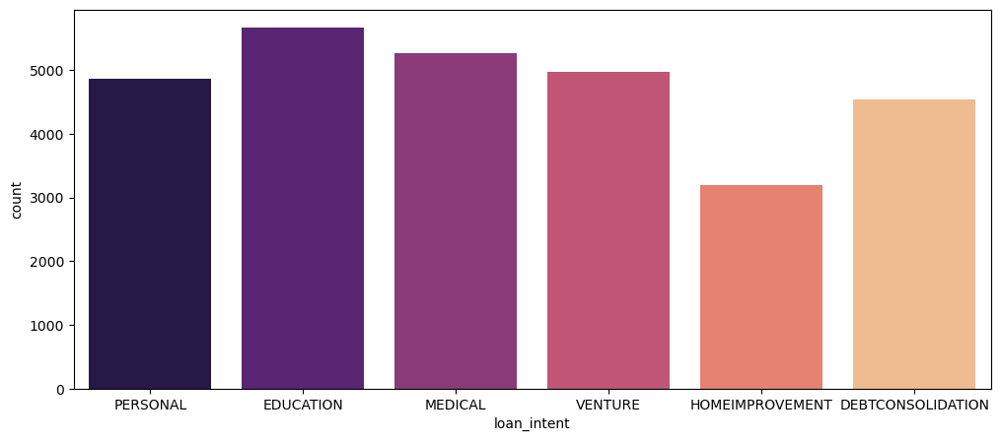
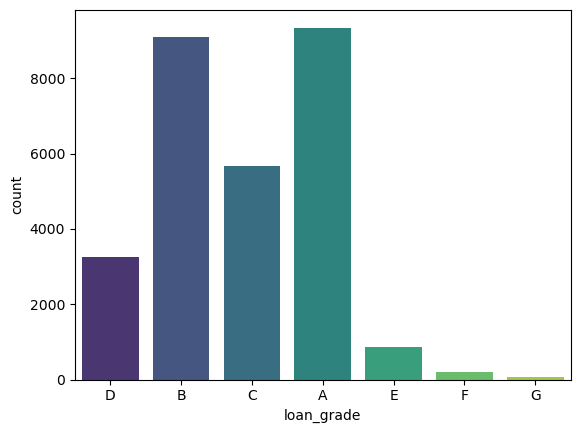

# Data Loading and Cleaning
dropping duplicated rows  
replacing empty value with null  
checking for null ways in any column  
dropping rows which contain any null value  
deleting one column which is unnecessary   loan_percent_income=(loan_amnt/person_income)*100
# Visualizations
`Hist plot`

`person_home_ownership`

`loan_intent`

`loan_grade`

`loan_status`

`cb_person_default_on_file`

# Logistic Regression

